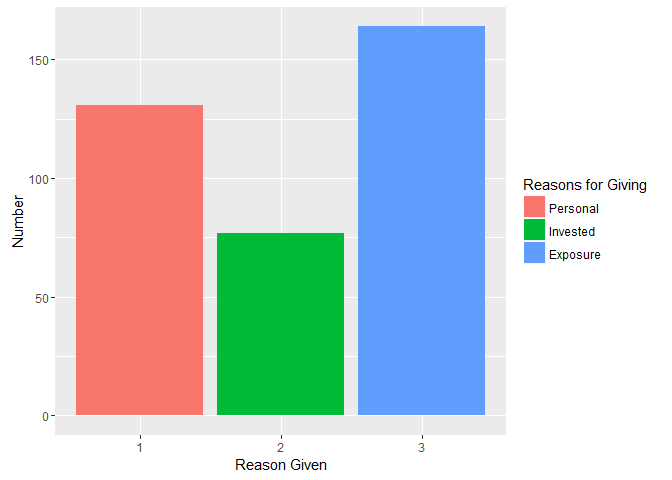
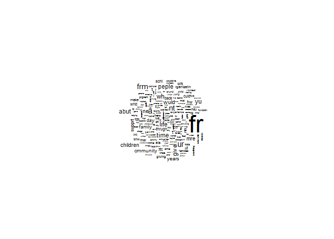
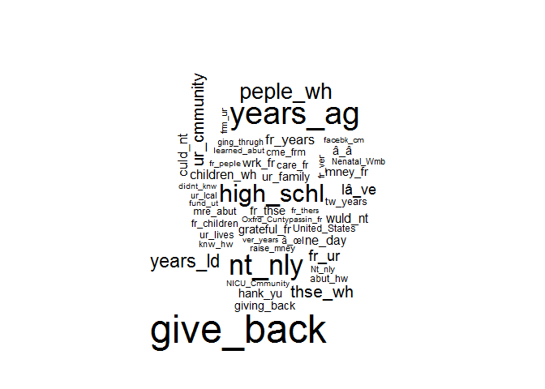
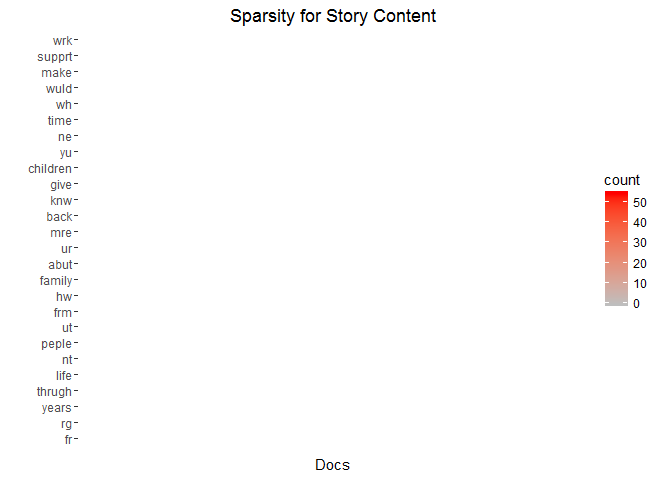
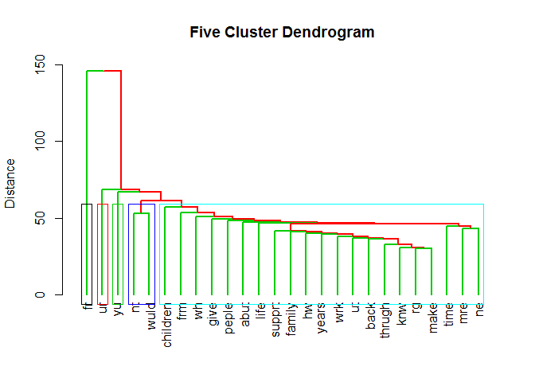
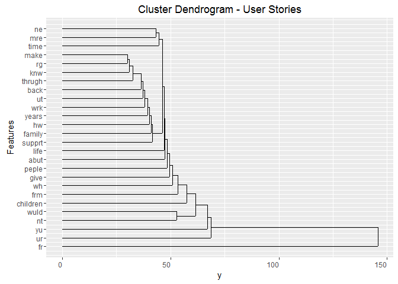
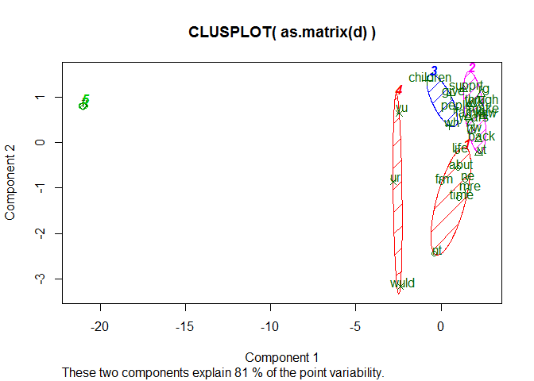

# MyGivingStory_Assignment3
Steven Nichols  
November 29, 2016  


##Premise for project 


```r
options(Encoding="UTF-8")

#From November 2- December 1, 2015, GivingTuesday asked individuals to reflect upon why they give to a certain nonprofit organization and then share these personal stories on social media. The top 15 "Liked" submissions on Facebook and Twitter were shared with a panel of nonprofit experts for final adjudication. Six winners were awarded $100-500 GlobalGiving gift cards and their chosen nonprofit organizations received $1,000-5,000 grants. The results of the contest exceeded expectations: there were 824 entries, 81,717 votes and 178,435 story views during the contest period. 

#Gates is interested in learning about what inspires people to give. This insight will be used by the Fundation to for the #MyGivingStory 2016 campaign
```

## Activate (possible needed) libraries and read in data 


```r
library(quanteda)
library(stm)
library(tm)
library(NLP)
library(ggplot2)
library(ggdendro)
library(cluster)
library(fpc)  
library(dplyr)
require(magrittr)
library(tm)
library(stringr)
library(tidytext)
library(plyr)
library(syuzhet)


setwd("C:\\Users\\Steven\\Google Drive\\1. MOT\\1) Fall 2016\\1. BA\\Assignments\\Midterm\\BA_Assignment\\Assignment 3")

raw <- read.csv("data\\raw.csv", header=TRUE, stringsAsFactors=FALSE)
```

## Create bar graph of codified reasons ("give_reason" vector)


```r
reasons <- raw$give_reason
reasons <- as.factor(reasons)
reason_num <- c("1", "2", "3")
reasons <- raw[raw$give_reason %in% reason_num,]
reasons <- subset(reasons, select=c("give_reason"))
```

##Plot graph 


```
## starting httpd help server ...
```

```
##  done
```

<!-- -->

Create corpus for text analysis 


```r
#create unique ID for rows 
raw$ID<-seq.int(nrow(raw))

require(quanteda)
```

#remove weird character for apostrophe 


```r
library(stringr)
raw$Story_Text <- gsub("'", "", raw$Story_Text, fixed=TRUE) 
raw$Story_Text <- gsub("\\n", " ", raw$Story_Text, fixed=TRUE)
 
raw$Story_Text <- gsub("??", "", raw$Story_Text, fixed=TRUE) 
raw$Story_Text <- gsub("???", "", raw$Story_Text, fixed=TRUE) 
raw$Story_Text <- gsub("o", "", raw$Story_Text, fixed=TRUE) 
raw$Story_Text <- gsub("'", "", raw$Story_Text, fixed=TRUE) 
raw$Story_Text <- gsub("T", "", raw$Story_Text, fixed=TRUE) 
raw$Story_Text <- gsub("`", "", raw$Story_Text, fixed=TRUE) 
raw$Story_Text <- gsub(",", " ", raw$Story_Text, fixed=TRUE)
raw$Story_Text <- gsub(".", " ", raw$Story_Text, fixed=TRUE)


story_corpus<- corpus(raw$Story_Text,docnames=raw$ID, docvars=raw[, c("ipaddress", "give_reason")] )
```

##clean data


```r
corp <- toLower(story_corpus, keepAcronym=FALSE)
cleancorpus <- tokenize(story_corpus, 
                        removeNumbers=TRUE,  
                        removePunct = TRUE,
                        removeSeparators=TRUE,
                        removeTwitter=FALSE,
                        verbose=TRUE)


stop_words <- stopwords("SMART")
stop_words2 <- stopwords("english")
## additional junk words showing up in the data
stop_words <- c(stop_words, stop_words2, "said", "www", "facebook", "the", "also", "say", "just", "like","for", 
                "us", "can", "may", "now", "year", "according", "mr")
stop_words <- tolower(stop_words)

dfm.story <- dfm(cleancorpus, toLower=TRUE, ignoredFeatures = c(stop_words, stopwords("english")), verbose=TRUE, stem=FALSE)


topfeatures_story <- topfeatures(dfm.story, n=50)
topfeatures_story
```

```
##         fr         ur          â        frm         nt         wh 
##       3613       1148       1105       1068       1036        904 
##       give         yu       life       time       abut      peple 
##        883        876        873        857        813        781 
##         ne   children        mre       wuld      years   cmmunity 
##        764        763        744        717        676        638 
##         hw     supprt        day     family         ut       culd 
##        589        589        580        558        534        531 
##        wrk       schl       back       wrld     thrugh     giving 
##        529        525        518        487        472        457 
##       make        knw rganizatin       ther        lve        nly 
##        444        442        423        422        419        406 
##        int         rg        hey        als         nw        ver 
##        405        400        398        389        381        359 
##       thse        hme      thers   families      lives        mst 
##        356        355        354        353        341        338 
##         gd       kids 
##        331        319
```


```r
bigram_story <- tokenize(story_corpus, removeNumbers=TRUE, removePunct=TRUE, removeSeparators=TRUE, removeTwitter=FALSE, ngrams=2, verbose=TRUE) 

stopstop <- c("www", "http")

dfm.bigram_story <- dfm(bigram_story, ignoredFeatures= c(stop_words, stopwords("english")), verbose=TRUE, stem=FALSE)

topfeatures.bigram_story<-topfeatures(dfm.bigram_story, n=50)
topfeatures.bigram_story
```

```
##     give_back      years_ag        nt_nly     high_schl      peple_wh 
##           146           122           107            94            81 
##      years_ld       thse_wh   ur_cmmunity         fr_ur         Iâ_ve 
##            66            61            58            55            53 
##      fr_years       culd_nt   children_wh        ne_day       wuld_nt 
##            50            47            46            45            44 
##       mney_fr     ur_family        wrk_fr       hank_yu   grateful_fr 
##            43            43            42            41            41 
##   giving_back       fr_thse           â_â       care_fr      tw_years 
##            39            39            38            37            37 
##      mre_abut   fr_children      ur_lives United_States       cme_frm 
##            36            34            34            33            33 
##       abut_hw          â_œI   ging_thrugh       ur_lcal        knw_hw 
##            33            32            31            31            31 
##    raise_mney        fr_ver   Nenatal_Wmb        Nt_nly        frm_ur 
##            30            30            30            29            29 
##      fr_peple       fund_ut   Oxfrd_Cunty NICU_Cmmunity     facebk_cm 
##            28            28            28            28            27 
##     didnt_knw      fr_thers  learned_abut     ver_years     passin_fr 
##            27            26            26            26            25
```


## Word cloud of top features 

<!-- --><!-- -->

#advanced analysis  -------------------------


```r
require(tm)
dfmStory<- dfm(cleancorpus,
          ignoredFeatures = c(stop_words, stopwords("english")), 
          verbose=TRUE, 
          stem=FALSE)
# Reviewing top features
topfeatures(dfmStory, 50)    # displays 50 features
```

```
##         fr         ur          â        frm         nt         wh 
##       3442       1148       1077       1022        973        884 
##       time       give       abut       life         yu         ne 
##        857        841        792        775        770        761 
##      peple        mre       wuld   children      years     supprt 
##        751        720        707        695        661        571 
##         hw   cmmunity         ut       culd        wrk     family 
##        547        543        534        530        526        524 
##        day       back     thrugh       schl       wrld        knw 
##        512        493        472        468        449        441 
##       make rganizatin       ther        nly        int         rg 
##        435        423        422        406        405        400 
##        hey        lve        als        ver       thse      thers 
##        393        374        371        359        356        354 
##   families        hme     giving      lives        mst         nw 
##        346        344        338        322        306        305 
##       made       mney 
##        296        283
```

```r
dfmStory.tm<-convert(dfmStory, to="tm")
dfmStory.tm
```

```
## <<DocumentTermMatrix (documents: 823, terms: 18229)>>
## Non-/sparse entries: 109173/14893294
## Sparsity           : 99%
## Maximal term length: 97
## Weighting          : term frequency (tf)
```

```r
dtmssStory <- removeSparseTerms(dfmStory.tm, 0.65)
dtmssStory
```

```
## <<DocumentTermMatrix (documents: 823, terms: 26)>>
## Non-/sparse entries: 9924/11474
## Sparsity           : 54%
## Maximal term length: 8
## Weighting          : term frequency (tf)
```

```r
d.dfmStory <- dist(t(dtmssStory), method="euclidian")
d.dfmStory
```

```
##                 fr        rg     years    thrugh      life        nt
## rg       158.13918                                                  
## years    146.33181  37.98684                                        
## thrugh   153.92855  30.65942  39.98750                              
## life     141.96831  46.65833  47.22288  46.11941                    
## nt       129.72664  59.79130  56.12486  58.83026  56.30275          
## peple    147.34653  44.41846  48.08326  45.53021  53.02829  60.56402
## ut       148.12832  36.79674  40.08740  38.36665  45.04442  51.15662
## frm      132.44622  54.97272  51.19570  52.95281  55.77634  54.61685
## hw       149.36198  39.33192  43.19722  40.82891  48.68265  54.36911
## family   151.20847  38.85872  44.01136  39.01282  47.04253  58.11196
## abut     140.26404  46.98936  47.96874  47.07441  49.44694  56.24055
## ur       136.95255  67.77905  66.14378  66.84310  71.54719  68.69498
## mre      140.15705  44.11349  46.27094  44.09082  46.48656  49.56813
## back     147.89523  36.83748  40.39802  37.34970  43.49713  53.38539
## knw      153.52199  30.83829  38.67816  33.98529  44.83302  54.97272
## give     149.12746  45.11097  48.78524  45.83667  51.61395  62.89674
## children 151.64102  51.19570  56.17829  52.31635  61.23724  69.46942
## yu       150.55896  63.93747  67.16398  64.09368  67.05967  69.33253
## ne       140.41011  45.96738  45.23273  44.30576  47.95832  49.85980
## time     135.87126  48.44585  48.55924  48.28043  47.95832  50.47772
## wh       140.37094  49.23413  49.38623  49.63869  53.78662  57.00000
## wuld     135.94484  68.89848  67.52777  67.46110  64.00000  52.82045
## make     153.54804  30.21589  37.86819  33.30165  45.36518  55.46170
## supprt   154.35997  36.12478  43.56604  37.58989  51.59457  62.76942
## wrk      152.01316  36.38681  41.48494  37.12142  48.93874  57.57604
##              peple        ut       frm        hw    family      abut
## rg                                                                  
## years                                                               
## thrugh                                                              
## life                                                                
## nt                                                                  
## peple                                                               
## ut        46.91482                                                  
## frm       56.13377  50.85273                                        
## hw        46.23851  39.83717  52.12485                              
## family    49.76947  41.03657  55.17246  43.41659                    
## abut      51.44900  44.06813  52.57376  46.40043  48.62098          
## ur        70.90134  65.75713  69.07966  68.13956  66.85806  65.96969
## mre       49.32545  40.24922  50.17968  46.05432  47.26521  44.27189
## back      48.86717  37.72267  49.62862  41.30375  41.34005  45.42026
## knw       44.36215  36.15245  53.46962  36.98648  38.48376  45.37621
## give      52.44044  49.28489  61.57110  50.31898  47.84349  54.96362
## children  62.33779  56.41808  66.00758  57.42822  54.78138  60.30755
## yu        67.72739  64.29619  69.72804  63.39558  66.93280  69.02174
## ne        51.90376  41.62932  49.44694  45.29901  47.16991  49.38623
## time      53.51635  43.53160  52.54522  46.94678  49.58831  48.42520
## wh        50.72475  49.61854  55.55178  47.69696  51.90376  54.64430
## wuld      73.59348  59.23681  66.65583  66.00000  67.81593  61.27805
## make      44.89989  36.81032  53.80520  38.13135  40.43513  46.55105
## supprt    49.43683  45.17743  54.83612  46.77606  45.04442  52.29723
## wrk       46.09772  40.64480  51.94228  41.94043  44.18144  48.47680
##                 ur       mre      back       knw      give  children
## rg                                                                  
## years                                                               
## thrugh                                                              
## life                                                                
## nt                                                                  
## peple                                                               
## ut                                                                  
## frm                                                                 
## hw                                                                  
## family                                                              
## abut                                                                
## ur                                                                  
## mre       64.71476                                                  
## back      66.85058  41.94043                                        
## knw       66.92533  42.76681  35.27038                              
## give      70.57620  53.18834  44.92215  44.74371                    
## children  73.53231  57.85326  56.60389  53.16014  58.24088          
## yu        83.66600  67.09694  64.17944  61.39218  65.09224  77.14272
## ne        64.41273  43.11612  43.86342  43.58899  53.96295  59.68249
## time      66.68583  43.78356  44.87761  46.88283  53.51635  63.43501
## wh        68.14690  52.51666  49.76947  47.94789  56.04463  58.38664
## wuld      73.38256  54.59853  61.41661  63.84356  74.21590  79.17070
## make      67.97794  43.00000  36.74235  31.11270  45.01111  53.10367
## supprt    67.14909  50.44799  42.33202  39.82462  49.87986  55.08176
## wrk       68.42514  47.11688  39.58535  37.85499  48.63127  54.96362
##                 yu        ne      time        wh      wuld      make
## rg                                                                  
## years                                                               
## thrugh                                                              
## life                                                                
## nt                                                                  
## peple                                                               
## ut                                                                  
## frm                                                                 
## hw                                                                  
## family                                                              
## abut                                                                
## ur                                                                  
## mre                                                                 
## back                                                                
## knw                                                                 
## give                                                                
## children                                                            
## yu                                                                  
## ne        61.89507                                                  
## time      67.40178  45.69464                                        
## wh        68.42514  49.56813  52.12485                              
## wuld      80.15610  59.79967  56.53318  73.96621                    
## make      62.34581  44.56456  48.39421  49.96999  65.26868          
## supprt    68.06614  51.51699  52.61179  50.86256  73.48469  40.64480
## wrk       65.00769  47.88528  49.96999  50.09990  70.49113  37.45664
##             supprt
## rg                
## years             
## thrugh            
## life              
## nt                
## peple             
## ut                
## frm               
## hw                
## family            
## abut              
## ur                
## mre               
## back              
## knw               
## give              
## children          
## yu                
## ne                
## time              
## wh                
## wuld              
## make              
## supprt            
## wrk       39.48417
```

```r
fitStory <- hclust(d=d.dfmStory, method="average")
hcdStory <- as.dendrogram(fitStory)
```


```r
library(slam)
dfmDenseStory <- as.matrix(dtmssStory)
library(reshape2)
dfmDenseStory <- melt(dfmDenseStory, value.name="count")

library(ggplot2)
```


```r
require(cluster)
require(ggdendro)

p <- ggplot(dfmDenseStory, aes(x = Docs, y = Terms, fill = count)) +
  geom_tile(color = "white") +
  scale_fill_gradient(high="red" , low="grey")+
  ylab("") +
  theme(panel.background = element_blank()) +
  theme(axis.text.x = element_blank(), axis.ticks.x = element_blank())
p + labs(title="Sparsity for Story Content")
```

<!-- -->

```r
k<-5
plot(hcdStory, ylab = "Distance", horiz = FALSE, 
     main = "Five Cluster Dendrogram", 
     edgePar = list(col = 2:3, lwd = 2:2))
rect.hclust(fitStory, k=k, border=1:5) # draw dendogram with red borders around the 5 clusters
```

<!-- -->

```r
ggdendrogram(fitStory, rotate = TRUE, size = 4, theme_dendro = FALSE,  color = "blue") +
  xlab("Features") + 
  ggtitle("Cluster Dendrogram - User Stories")
```

<!-- -->


<!-- -->


